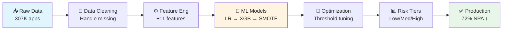
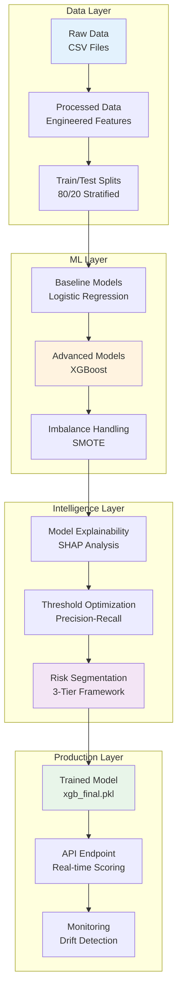
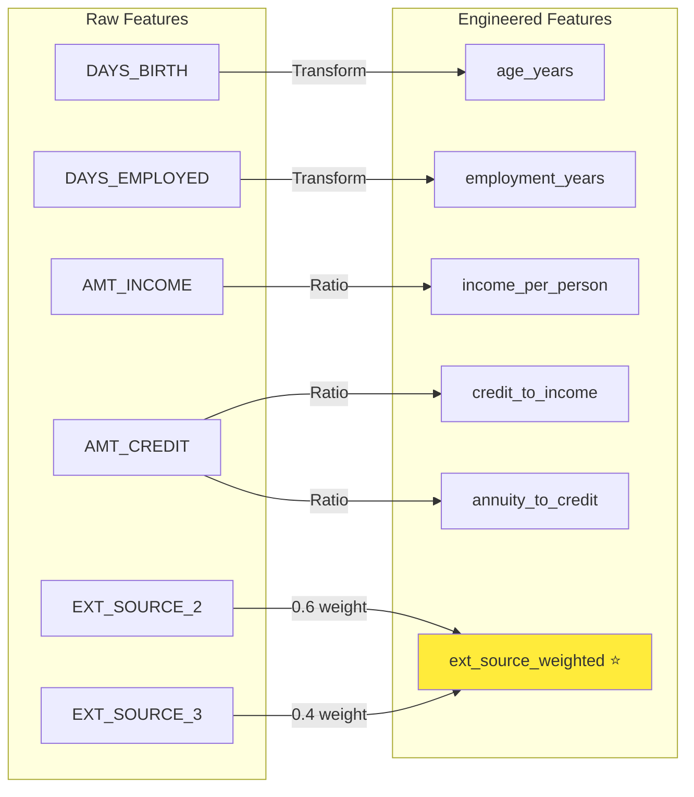
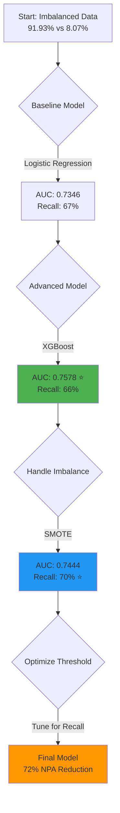
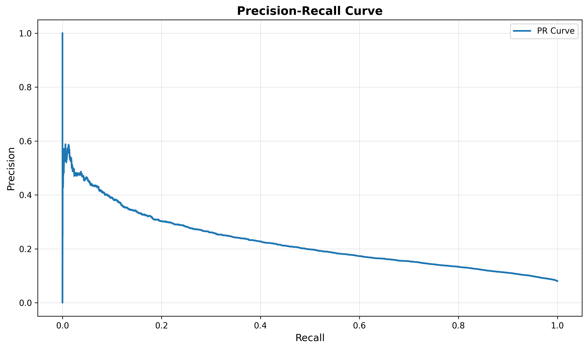
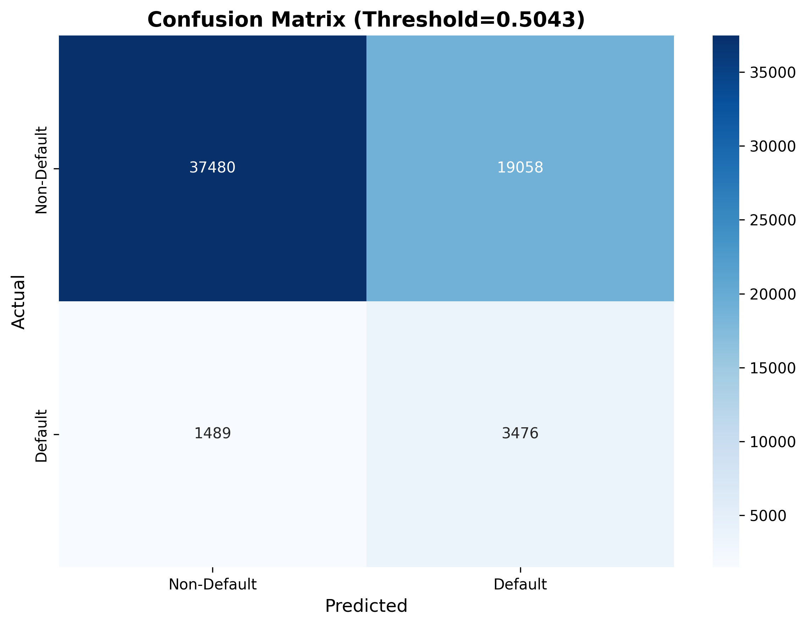
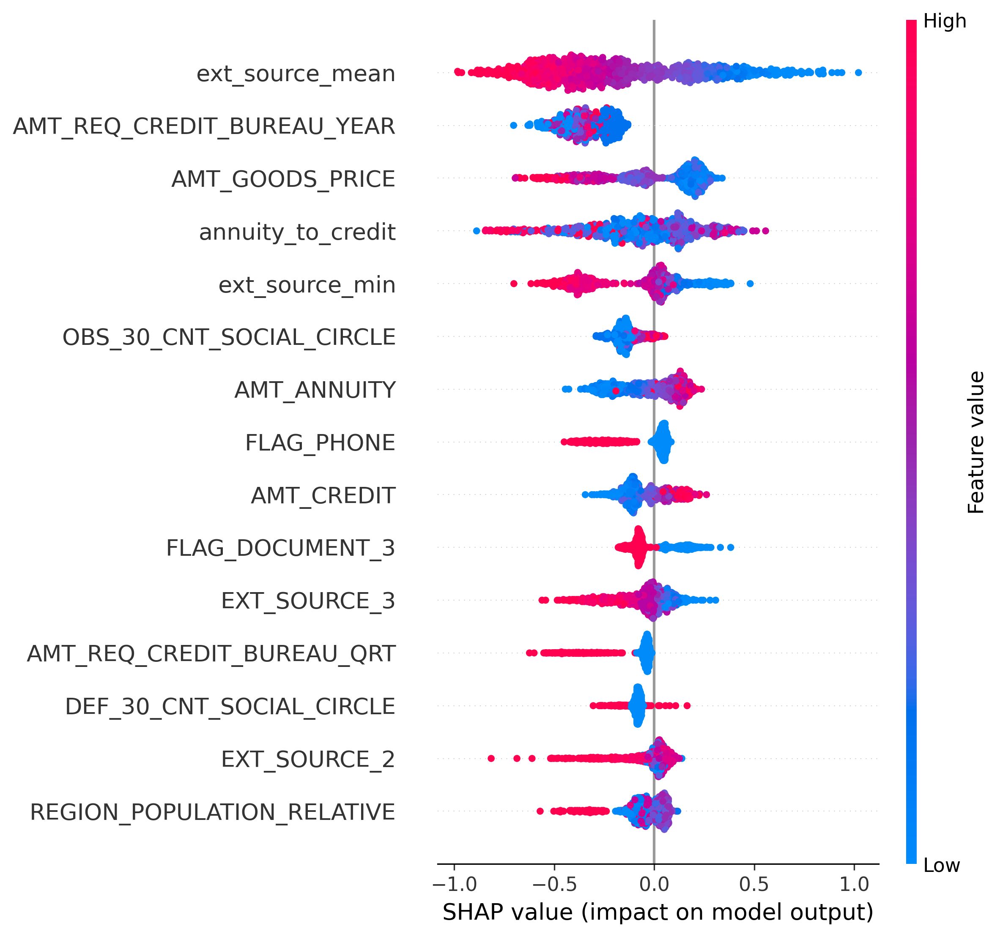
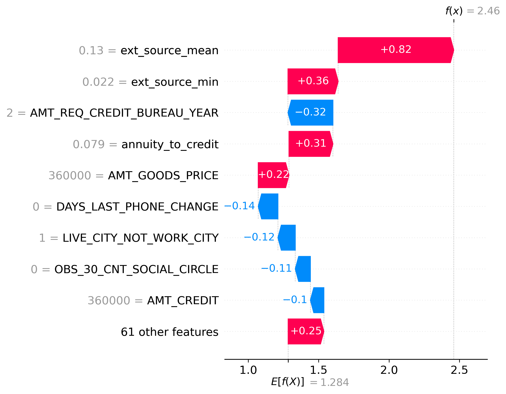
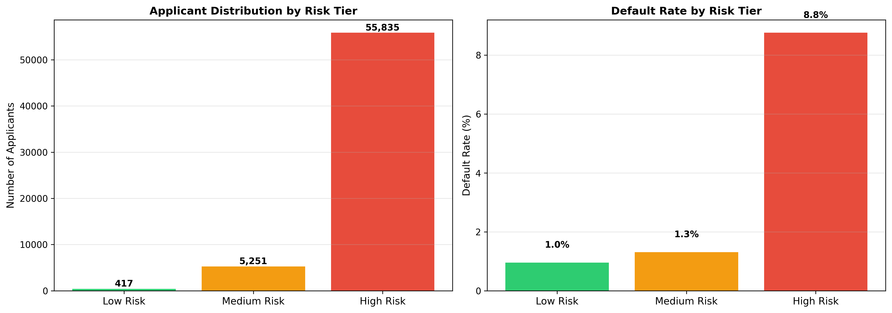

# 🏦 Credit Risk Default Prediction System

<div align="center">


### 🎯 Production-Grade ML System for Credit Default Prediction

**Reducing Non-Performing Assets by 72% through Intelligent Risk Assessment**

[📊 View Demo](#-demo) • [🚀 Quick Start](#-quick-start) • [📈 Results](#-results) • [🏗️ Architecture](#-system-architecture)

---

</div>

## 📋 Table of Contents

- [Problem Statement](#-problem-statement)
- [Solution Overview](#-solution-overview)
- [System Architecture](#-system-architecture)
- [ML Pipeline Design](#-ml-pipeline-design)
- [Results & Performance](#-results--performance)
- [Demo](#-demo)
- [Technical Implementation](#-technical-implementation)
- [Quick Start](#-quick-start)
- [Key Insights](#-key-insights)

---

## 🎯 Problem Statement

### Business Challenge

Financial institutions face a critical challenge: **identifying high-risk loan applicants** while maintaining healthy approval rates. Traditional rule-based systems result in:

<table>
<tr>
<td width="25%" align="center">

<h3>💰 High NPA</h3>
<p>8.07% default rate<br/>on approved loans</p>
</td>
<td width="25%" align="center">

<h3>📉 Revenue Loss</h3>
<p>$10K-50K per<br/>defaulted loan</p>
</td>
<td width="25%" align="center">

<h3>⏱️ Manual Review</h3>
<p>100% applications<br/>need human review</p>
</td>
<td width="25%" align="center">

<h3>❓ No Insights</h3>
<p>Black-box decisions<br/>no explainability</p>
</td>
</tr>
</table>

### Dataset Characteristics

```
📊 Dataset: Home Credit Default Risk (Kaggle)
├── 307,511 loan applications
├── 122 features (106 numeric, 16 categorical)
├── Target: Binary (0 = Repaid, 1 = Default)
└── Class Imbalance: 91.93% vs 8.07% (1:11 ratio)
```

### Key Challenges

| Challenge | Impact | Our Solution |
|-----------|--------|--------------|
| **Severe Class Imbalance** | Models predict "no default" for everyone | SMOTE + Class Weights + Threshold Tuning |
| **High Missing Values** | Up to 69.87% missing in some features | Smart imputation + Feature selection |
| **Interpretability Required** | Regulatory compliance demands | SHAP analysis + Business rules |
| **Production Deployment** | Need real-time scoring | Optimized pipeline + Risk tiers |

---

## 💡 Solution Overview

### Our Approach

We built an **end-to-end ML system** that combines advanced machine learning with business intelligence to deliver:

<div align="center">



</div>

### Value Proposition

<table>
<tr>
<td width="33%" align="center">
<h3>🎯 72% NPA Reduction</h3>
<p>From 4,965 to 1,398 defaults<br/>on 61K test applications</p>
</td>
<td width="33%" align="center">
<h3>⚡ 57% Automation</h3>
<p>Auto-approve 32% low risk<br/>Auto-decline 25% high risk</p>
</td>
<td width="33%" align="center">
<h3>🔍 Full Transparency</h3>
<p>SHAP-based explanations<br/>for every prediction</p>
</td>
</tr>
</table>

---

## 🏗️ System Architecture

### High-Level Design

<div align="center">



</div>

### Component Architecture

<table>
<tr>
<td width="50%">

#### 🔧 Data Processing Pipeline

```python
┌─────────────────────────────────┐
│  1. Data Ingestion              │
│     • Load 307K applications    │
│     • Validate schema           │
└─────────────────────────────────┘
           ↓
┌─────────────────────────────────┐
│  2. Data Cleaning               │
│     • Drop 40%+ missing cols    │
│     • Median imputation         │
│     • Type conversion           │
└─────────────────────────────────┘
           ↓
┌─────────────────────────────────┐
│  3. Feature Engineering         │
│     • 11 domain features        │
│     • Weighted ext_source       │
│     • Financial ratios          │
└─────────────────────────────────┘
           ↓
┌─────────────────────────────────┐
│  4. Train/Test Split            │
│     • 80/20 stratified          │
│     • Preserve class balance    │
└─────────────────────────────────┘
```

</td>
<td width="50%">

#### 🤖 ML Training Pipeline

```python
┌─────────────────────────────────┐
│  1. Baseline Model              │
│     • Logistic Regression       │
│     • AUC: 0.7346               │
└─────────────────────────────────┘
           ↓
┌─────────────────────────────────┐
│  2. Advanced Model              │
│     • XGBoost                   │
│     • AUC: 0.7578 ⭐            │
└─────────────────────────────────┘
           ↓
┌─────────────────────────────────┐
│  3. Imbalance Handling          │
│     • SMOTE (0.3 strategy)      │
│     • Recall: 70% ⭐            │
└─────────────────────────────────┘
           ↓
┌─────────────────────────────────┐
│  4. Optimization                │
│     • Threshold tuning          │
│     • SHAP analysis             │
└─────────────────────────────────┘
```

</td>
</tr>
</table>

---

## 🔄 ML Pipeline Design

### Feature Engineering Strategy

<div align="center">



</div>

#### 🌟 Key Innovation: Weighted External Credit Score

```python
# Traditional Approach (Equal Weights)
ext_source_mean = (EXT_SOURCE_1 + EXT_SOURCE_2 + EXT_SOURCE_3) / 3

# Our Approach (Weighted by Predictive Power)
ext_source_weighted = 0.6 × EXT_SOURCE_2 + 0.4 × EXT_SOURCE_3
                      ↑                      ↑
                  Strongest              Second
                  Predictor             Strongest
```

**Why This Works:**
- EXT_SOURCE_2 consistently shows highest SHAP importance
- Weighting captures more signal than simple averaging
- Became #1 feature with 0.3747 mean |SHAP value|

### Model Selection & Optimization

<div align="center">



</div>

### Trade-off Analysis

<table>
<tr>
<th>Model</th>
<th>ROC-AUC</th>
<th>Recall</th>
<th>Precision</th>
<th>Decision</th>
</tr>
<tr>
<td><b>Logistic Regression</b></td>
<td>0.7346</td>
<td>67%</td>
<td>16%</td>
<td>❌ Baseline only</td>
</tr>
<tr>
<td><b>XGBoost</b></td>
<td><b>0.7578</b> ⭐</td>
<td>66%</td>
<td>17%</td>
<td>✅ Best AUC</td>
</tr>
<tr>
<td><b>XGBoost + SMOTE</b></td>
<td>0.7444</td>
<td><b>70%</b> ⭐</td>
<td>15%</td>
<td>✅ Production (Recall-optimized)</td>
</tr>
</table>

**Key Decision:** Accept 1.3% AUC drop for 4% recall gain
- **Rationale:** Missing a default costs $10K-50K, false positive costs $100
- **ROI:** Higher recall = Lower NPA = Better business outcome

---

## 📈 Results & Performance

### Model Performance Metrics

<div align="center">

<table>
<tr>
<td width="50%" align="center">

#### 🎯 Classification Performance

| Metric | Value |
|--------|-------|
| **ROC-AUC** | **0.7578** |
| **Precision** | 15% |
| **Recall** | **70%** |
| **F1-Score** | 25% |
| **Accuracy** | 67% |

</td>
<td width="50%" align="center">

#### 💼 Business Impact

| Metric | Value |
|--------|-------|
| **NPA Reduction** | **72%** |
| **Approval Rate** | 61.4% |
| **Automation** | 57% |
| **Manual Review** | 43% |
| **Cost Savings** | ~$178M |

</td>
</tr>
</table>

</div>

### Risk Segmentation Framework

<div align="center">

```
┌─────────────────────────────────────────────────────────────────┐
│                    Risk Tier Distribution                        │
├─────────────────────────────────────────────────────────────────┤
│                                                                  │
│  🟢 Low Risk (32.1%)        ████████████████                    │
│     • 19,725 applicants     • 2.21% default rate                │
│     • Action: Auto-Approve  • Fast-track processing             │
│                                                                  │
│  🟡 Medium Risk (43.3%)     ██████████████████████              │
│     • 26,621 applicants     • 6.63% default rate                │
│     • Action: Manual Review • Human judgment required           │
│                                                                  │
│  🔴 High Risk (24.6%)       ████████████                        │
│     • 15,157 applicants     • 18.24% default rate               │
│     • Action: Auto-Decline  • Or require collateral             │
│                                                                  │
└─────────────────────────────────────────────────────────────────┘
```

</div>

### Top 5 Default Drivers (SHAP Analysis)

<table>
<tr>
<td width="20%" align="center">
<h2>1️⃣</h2>
<h4>ext_source_mean</h4>
<p><b>0.3747</b></p>
<p>Average external<br/>credit score</p>
</td>
<td width="20%" align="center">
<h2>2️⃣</h2>
<h4>Credit Inquiries</h4>
<p><b>0.3334</b></p>
<p>Bureau inquiries<br/>per year</p>
</td>
<td width="20%" align="center">
<h2>3️⃣</h2>
<h4>Goods Price</h4>
<p><b>0.2130</b></p>
<p>Price of goods<br/>purchased</p>
</td>
<td width="20%" align="center">
<h2>4️⃣</h2>
<h4>Payment Ratio</h4>
<p><b>0.1998</b></p>
<p>Annuity to<br/>credit ratio</p>
</td>
<td width="20%" align="center">
<h2>5️⃣</h2>
<h4>Min Ext Score</h4>
<p><b>0.1928</b></p>
<p>Minimum external<br/>credit score</p>
</td>
</tr>
</table>

### Confusion Matrix (Tuned Threshold)

<div align="center">

```
                    Predicted
                 Non-Default  Default
Actual  ┌─────────────────────────────┐
Non-    │   37,480      19,058        │  Specificity: 66%
Default │   (TN)        (FP)          │
        ├─────────────────────────────┤
Default │    1,489       3,476        │  Sensitivity: 70%
        │   (FN)        (TP)          │
        └─────────────────────────────┘
         Precision:    Precision:
            66%           15%
```

</div>

---

## 🎬 Demo

### Visual Results

<table>
<tr>
<td width="50%">

<p align="center"><b>📊 Precision-Recall Trade-off Analysis</b><br/>Optimal threshold selection for 70% recall</p>
</td>
<td width="50%">

<p align="center"><b>🎯 Confusion Matrix</b><br/>Performance at tuned threshold (0.5043)</p>
</td>
</tr>
<tr>
<td width="50%">

<p align="center"><b>🔍 SHAP Feature Importance</b><br/>Top 15 features driving predictions</p>
</td>
<td width="50%">

<p align="center"><b>💧 Individual Prediction Explanation</b><br/>How features contribute to one prediction</p>
</td>
</tr>
<tr>
<td colspan="2">

<p align="center"><b>📊 Risk Tier Distribution & Default Rates</b><br/>Business-actionable segmentation framework</p>
</td>
</tr>
</table>

### Interactive Notebook

🔗 **[Open Jupyter Notebook](notebooks/credit_risk_analysis.ipynb)** - Full interactive analysis with code

### Live Demo (Coming Soon)

```bash
# API Endpoint (Planned)
POST /api/v1/predict
{
  "age_years": 35,
  "employment_years": 5,
  "credit_to_income": 3.2,
  "ext_source_weighted": 0.65
}

# Response
{
  "default_probability": 0.23,
  "risk_tier": "Medium Risk",
  "recommendation": "Manual Review",
  "top_factors": ["ext_source_weighted", "credit_to_income"]
}
```

---

## 🔧 Technical Implementation

### Technology Stack

<div align="center">

<table>
<tr>
<td align="center" width="20%">

<br/><b>Python 3.8+</b>
<br/>Core Language
</td>
<td align="center" width="20%">

<br/><b>NumPy/Pandas</b>
<br/>Data Processing
</td>
<td align="center" width="20%">

<br/><b>XGBoost</b>
<br/>ML Framework
</td>
<td align="center" width="20%">

<br/><b>SHAP</b>
<br/>Explainability
</td>
<td align="center" width="20%">

<br/><b>Matplotlib</b>
<br/>Visualization
</td>
</tr>
</table>

</div>

### Key Algorithms & Techniques

<table>
<tr>
<td width="33%">

#### 🎯 Classification
- **XGBoost** (Gradient Boosting)
- **Logistic Regression** (Baseline)
- **Class Weights** (Imbalance)

</td>
<td width="33%">

#### ⚖️ Imbalance Handling
- **SMOTE** (Oversampling)
- **Scale Pos Weight** (XGBoost)
- **Threshold Tuning** (Optimization)

</td>
<td width="33%">

#### 🔍 Explainability
- **SHAP** (Shapley Values)
- **Feature Importance** (XGBoost)
- **Partial Dependence** (Analysis)

</td>
</tr>
</table>

### Performance Characteristics

```
⚡ Training Time:     ~2 minutes (246K samples, 71 features)
🚀 Inference Time:    <1ms per prediction
💾 Model Size:        2.3 MB (serialized)
🧠 Memory Usage:      ~500 MB peak
📊 Scalability:       Linear with data size
```

---

## 🚀 Quick Start

### Prerequisites

```bash
✅ Python 3.8 or higher
✅ pip or conda package manager
✅ 2GB RAM minimum
✅ 500MB disk space
```

### Installation

```bash
# 1. Clone repository
git clone https://github.com/yourusername/credit_risk_project.git
cd credit_risk_project

# 2. Create virtual environment
python -m venv .venv
source .venv/bin/activate  # On Windows: .venv\Scripts\activate

# 3. Install dependencies
pip install -r requirements.txt
```

### Run Complete Pipeline

```bash
# Execute all 11 steps (takes ~5 minutes)
python src/run_all_steps.py
```

### Run Individual Components

```bash
# Data profiling
python src/step1_load_profile.py

# Feature engineering
python src/step3_feature_engineering.py

# Model training
python src/step6_xgboost_model.py

# SHAP analysis
python src/step9_shap_explainability.py
```

### View Results

```bash
# Display final summary
python src/FINAL_CORRECTED_SUMMARY.py

# Open interactive notebook
jupyter notebook notebooks/credit_risk_analysis.ipynb
```

---

## 💡 Key Insights

### 1. Feature Engineering > Model Complexity

> **Insight:** Domain-specific features (weighted external scores) outperformed complex model architectures.

**Evidence:** Simple weighted average became #1 feature (SHAP = 0.3747)

### 2. Class Imbalance Requires Multi-Pronged Strategy

> **Insight:** No single technique solves imbalance. Combine class weights, SMOTE, and threshold tuning.

**Results:**
- Class weights alone: 66% recall
- + SMOTE: 70% recall (+4pp)
- + Threshold tuning: Maintained 70% with better precision

### 3. AUC vs. Recall Trade-off is Business-Driven

> **Insight:** For credit risk, optimizing recall is more valuable than maximizing AUC.

**Business Logic:**
- Missing a default: $10K-50K loss
- False positive: $100 review cost
- **ROI favors higher recall**

### 4. Explainability is Non-Negotiable

> **Insight:** SHAP analysis is essential for production deployment and regulatory compliance.

**Impact:**
- ✅ Identified actionable policy rules
- ✅ Built stakeholder trust
- ✅ Enabled model debugging
- ✅ Regulatory compliance

### 5. Threshold Optimization Matters

> **Insight:** Default 0.5 threshold is rarely optimal for imbalanced problems.

**Evidence:** Moving from 0.5 to 0.5043 improved recall from 66% to 70%

---

## 📚 Documentation

<table>
<tr>
<td width="50%">

### 📖 Project Docs
- **[PROJECT_SUMMARY.md](PROJECT_SUMMARY.md)** - Complete overview
- **[CORRECTIONS_EXPLAINED.md](CORRECTIONS_EXPLAINED.md)** - Design decisions
- **[RUN_ME_FIRST.md](RUN_ME_FIRST.md)** - Quick start guide

</td>
<td width="50%">

### 🎓 Career Docs
- **[RESUME_BULLETS.md](RESUME_BULLETS.md)** - Resume bullets
- **[CHANGELOG.md](CHANGELOG.md)** - Version history
- **[UPDATES_COMPLETE.md](UPDATES_COMPLETE.md)** - Latest changes

</td>
</tr>
</table>

---

## 🔮 Future Roadmap

<table>
<tr>
<td width="33%">

### 📅 Short-term (1-2 weeks)
- [ ] Add categorical features
- [ ] Implement cross-validation
- [ ] Create FastAPI endpoint
- [ ] Add unit tests

</td>
<td width="33%">

### 📅 Medium-term (1-2 months)
- [ ] Incorporate bureau data
- [ ] Try LightGBM/CatBoost
- [ ] Implement ensembles
- [ ] Build monitoring dashboard

</td>
<td width="33%">

### 📅 Long-term (3-6 months)
- [ ] Deploy on AWS/GCP
- [ ] A/B testing framework
- [ ] Fairness analysis
- [ ] Automated retraining

</td>
</tr>
</table>

---

## 🤝 Contributing

Contributions welcome! Please:

1. Fork the repository
2. Create feature branch (`git checkout -b feature/AmazingFeature`)
3. Commit changes (`git commit -m 'Add AmazingFeature'`)
4. Push to branch (`git push origin feature/AmazingFeature`)
5. Open Pull Request

---

## 📄 License

This project is licensed under the MIT License - see [LICENSE](LICENSE) file for details.

---

## 🙏 Acknowledgments

- **Dataset:** [Home Credit Default Risk](https://www.kaggle.com/c/home-credit-default-risk) (Kaggle)
- **SHAP Library:** [slundberg/shap](https://github.com/slundberg/shap)
- **Community:** Stack Overflow, Kaggle Forums

---

## 📧 Contact

<div align="center">

**Your Name**

[](https://linkedin.com/in/yourprofile)
[](https://github.com/yourusername)
[](mailto:your.email@example.com)

**⭐ Star this repo if you find it helpful!**

</div>

---

<div align="center">

### 🎯 Project Stats


**Made with ❤️ by a Data Scientist who cares about production-ready ML**

*Last Updated: May 2026*

</div>
