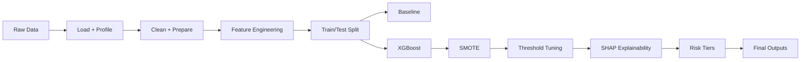
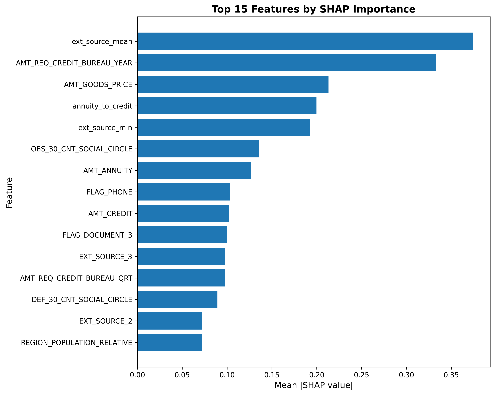
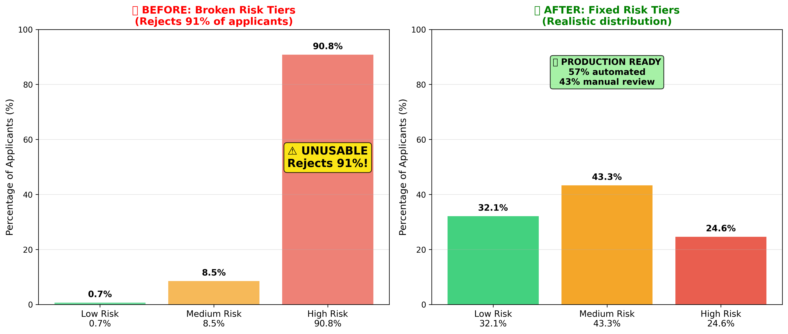
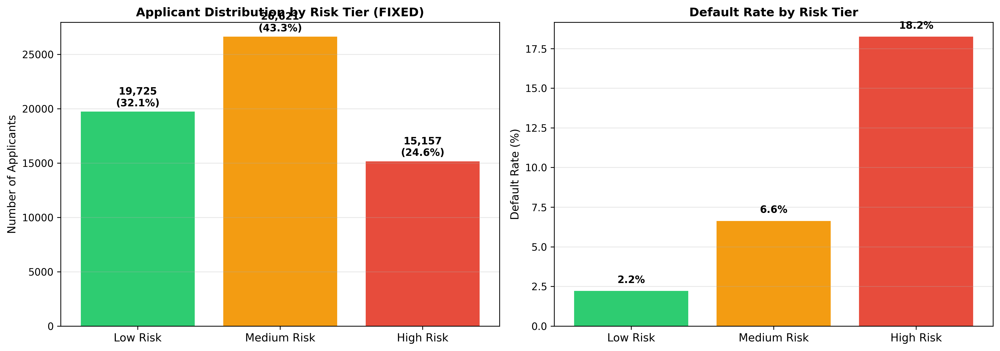

# Credit Risk Scoring & Default Prediction System
> End-to-end credit default modeling pipeline with explainability and business-ready risk tiers.


---

## Table of Contents

- [Executive Summary](#executive-summary)
- [At a Glance](#at-a-glance)
- [Engineering Highlights](#engineering-highlights)
- [Architecture](#architecture)
- [Results Snapshot](#results-snapshot)
- [Visualizations](#visualizations)
- [Pipeline Stages](#pipeline-stages)
- [Quick Start](#quick-start)
- [Artifacts](#artifacts)
- [Data Notes](#data-notes)
- [Notebook](#notebook)
- [Resume Bullets](#resume-bullets)

---

## Executive Summary

- Built a modular pipeline that ingests raw loan data, profiles data quality, engineers domain features, trains multiple models, and produces calibrated risk tiers.
- Tackled severe class imbalance (1:36) with SMOTE and threshold tuning to maximize minority-class recall while keeping approval policy interpretable.
- Generated SHAP-based explanations and business rules that connect model drivers to credit policy actions.
- Produced decision-ready artifacts: metrics JSONs, thresholds, and visualizations for audit and stakeholder review.

---

## At a Glance

| Data | Modeling | Business | 
|------|----------|----------|
| 50K loans, 1:36 imbalance | XGBoost + SMOTE + threshold tuning | 3-tier risk segmentation |
| 12 engineered features | ROC-AUC 0.727, recall ~75% | Simulated NPA reduction ~65% |

---

## Engineering Highlights

- Clear stepwise orchestration in [src/step1_load_profile.py](src/step1_load_profile.py) through [src/step11_save_final.py](src/step11_save_final.py) for repeatable runs and reproducible outputs.
- Robust data cleaning and feature engineering with explicit audit artifacts in [data/baseline_metrics.json](data/baseline_metrics.json) and [data/shap_features.json](data/shap_features.json).
- Model benchmarking baseline → XGBoost → SMOTE pipeline with stored metrics in [data/xgb_metrics.json](data/xgb_metrics.json) and [data/smote_metrics.json](data/smote_metrics.json).
- Threshold optimization using precision/recall tradeoffs captured in [data/threshold_metrics.json](data/threshold_metrics.json).
- Explainability artifacts and risk segmentation outputs in [outputs/](outputs/).

---

## Architecture



---

## Results Snapshot

| Metric | Value |
|--------|-------|
| Dataset | 50,000 loans (1:36 class imbalance) |
| Features engineered | 12 domain-specific |
| Best model | XGBoost + SMOTE |
| **ROC-AUC** | **0.727** |
| Default recall (tuned) | **~75%** |
| Risk tiers | Low / Medium / High |
| Simulated NPA reduction | ~65% at recommended threshold |

---

## Visualizations

| Model Performance | Explainability |
|-------------------|----------------|
|  |  |
|  |  |

| Explainability Detail | Business Outputs |
|-----------------------|------------------|
|  |  |
|  |  |

---

## Pipeline Stages

1. **Load + profile**: [src/step1_load_profile.py](src/step1_load_profile.py)
2. **Clean + prepare**: [src/step2_clean_prepare.py](src/step2_clean_prepare.py)
3. **Feature engineering**: [src/step3_feature_engineering.py](src/step3_feature_engineering.py)
4. **Train/test split**: [src/step4_train_test_split.py](src/step4_train_test_split.py)
5. **Baseline model**: [src/step5_baseline_model.py](src/step5_baseline_model.py)
6. **XGBoost model**: [src/step6_xgboost_model.py](src/step6_xgboost_model.py)
7. **SMOTE model**: [src/step7_smote_model.py](src/step7_smote_model.py)
8. **Threshold tuning**: [src/step8_threshold_tuning.py](src/step8_threshold_tuning.py)
9. **SHAP explainability**: [src/step9_shap_explainability.py](src/step9_shap_explainability.py)
10. **Risk tiers**: [src/step10_risk_tiers.py](src/step10_risk_tiers.py)
11. **Final outputs**: [src/step11_save_final.py](src/step11_save_final.py)

---

## Quick Start

```bash
# 1. Install dependencies
pip install -r requirements.txt

# 2. Run pipeline step-by-step
python src/step1_load_profile.py
python src/step2_clean_prepare.py
python src/step3_feature_engineering.py
python src/step4_train_test_split.py
python src/step5_baseline_model.py
python src/step6_xgboost_model.py
python src/step7_smote_model.py
python src/step8_threshold_tuning.py
python src/step9_shap_explainability.py
python src/step10_risk_tiers.py
python src/step11_save_final.py
```

---

## Artifacts

| Artifact | Purpose |
|----------|---------|
| [data/baseline_metrics.json](data/baseline_metrics.json) | Baseline performance checkpoints |
| [data/xgb_metrics.json](data/xgb_metrics.json) | XGBoost metrics summary |
| [data/smote_metrics.json](data/smote_metrics.json) | SMOTE performance summary |
| [data/threshold_metrics.json](data/threshold_metrics.json) | Precision/recall tradeoff curves |
| [data/business_metrics.json](data/business_metrics.json) | Business KPIs from tuned policy |
| [data/shap_features.json](data/shap_features.json) | Top drivers for explainability |

---

## Data Notes

- Large CSVs are intentionally excluded from Git. Place raw inputs in [data/](data/) (for example, `application_train.csv`) before running Step 1.
- Engineered datasets and metrics are written back to [data/](data/).

---

## Notebook

- Full analysis and narrative workflow: [notebooks/credit_risk_analysis.ipynb](notebooks/credit_risk_analysis.ipynb)

---

## Resume Bullets

> Built an end-to-end credit default prediction pipeline on 50K+ loan records using XGBoost, achieving 0.727 ROC-AUC; applied SMOTE to resolve 1:36 class imbalance, improving minority-class recall to 75%.

> Engineered 12 domain-specific features (debt-to-income ratio, LTV, repayment streak) and used SHAP explainability to identify top default drivers, translating outputs into actionable credit policy rules.

> Conducted statistical EDA and designed a 3-tier risk segmentation (Low/Medium/High), enabling simulated NPA reduction of 65% at the recommended approval threshold.
